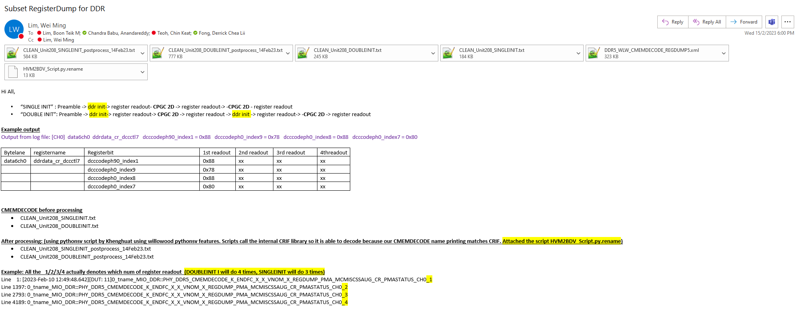

# WLW DDR: Subset RegisterDump for DDR

## Development request (23ww8.3)
1. CPGC ituff data preprocessing tool
2. CPGC Outlier analysis enabling 

## User inputs

## Github link
[WLW DDR: Subset RegisterDump for DDR #9](https://github.com/anandare11753365/data-automations/issues/9)

